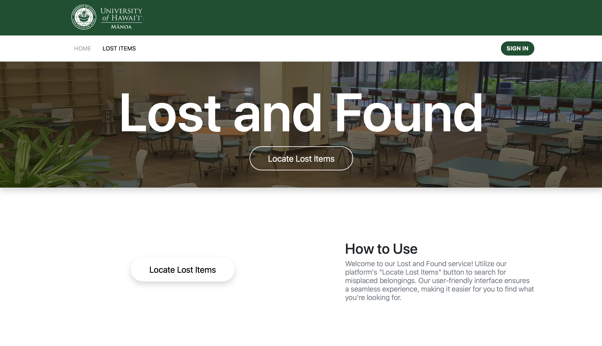
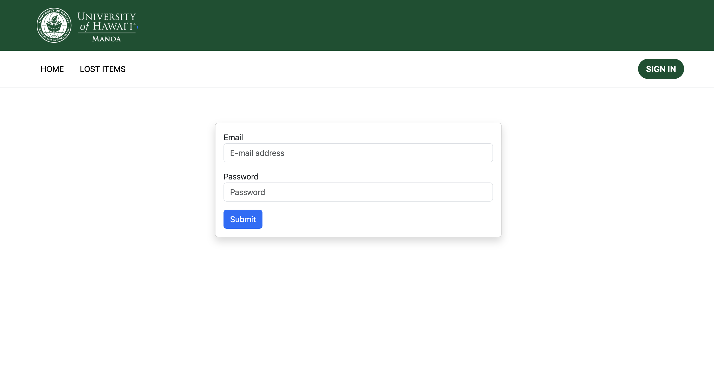
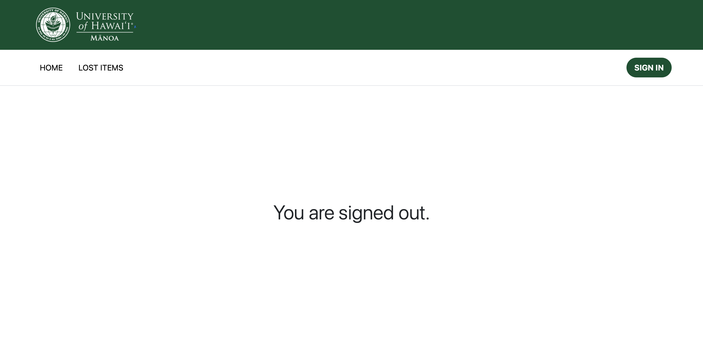
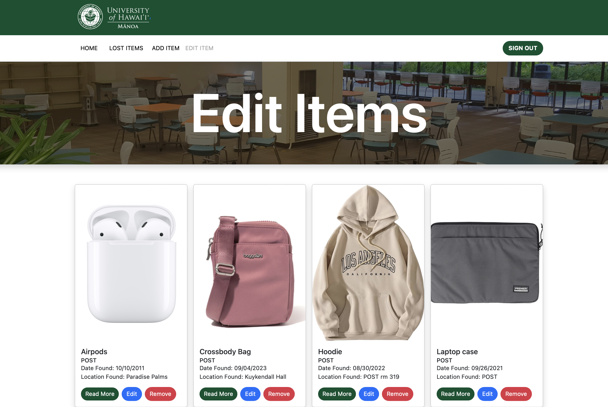
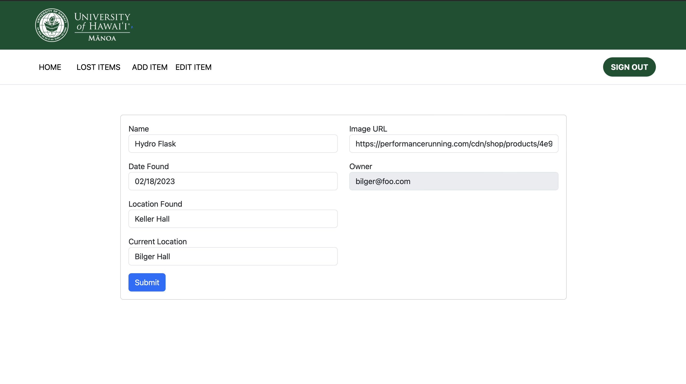
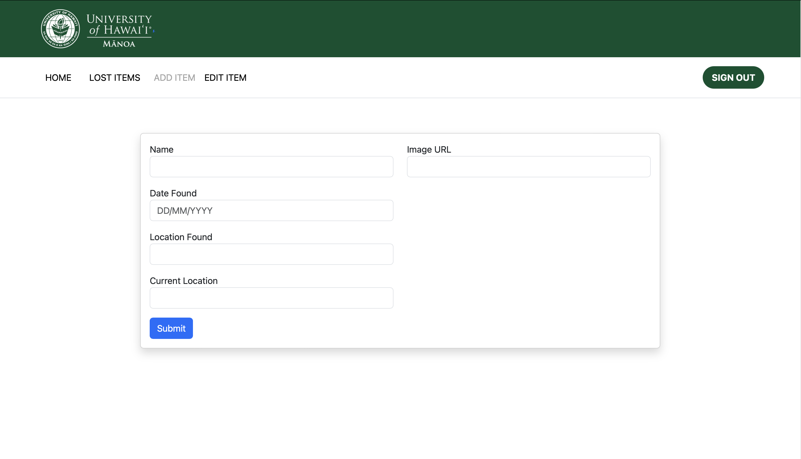
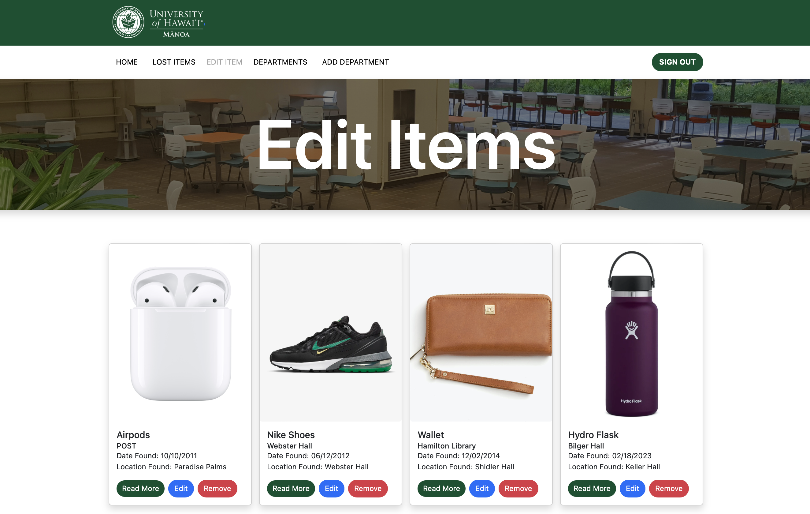
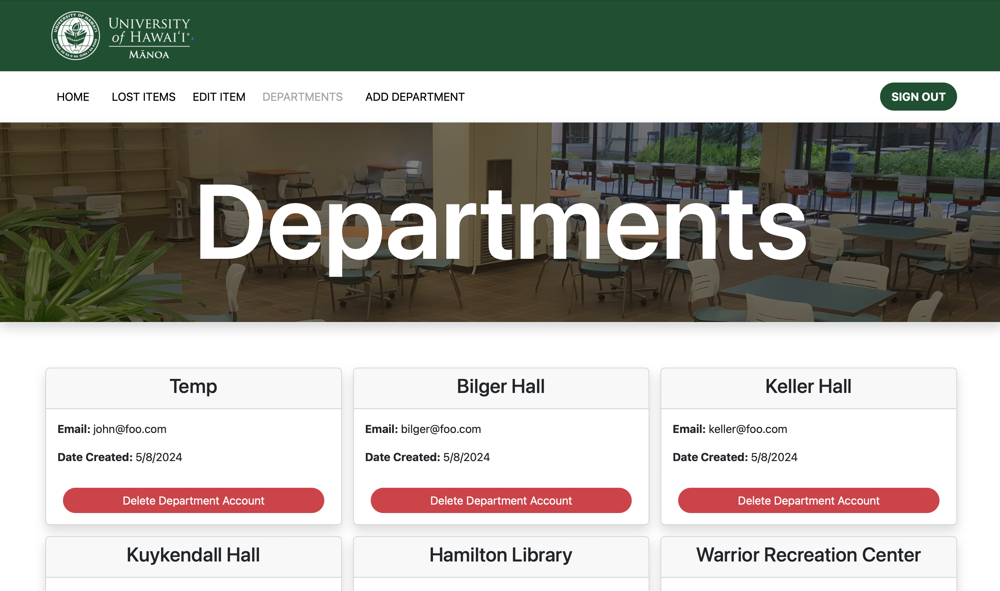
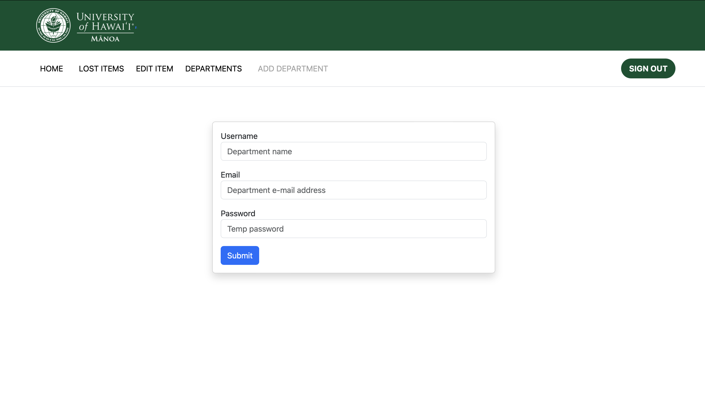

# UHM Lost and Found

## Table of Contents

* [Overview](#overview)
* [User Guide](#user-guide)
* [Deployment](#deployment)
* [Developer Guide](#developer-guide)
* [Community Feedback](#community-feedback)
* [Development History](#development-history)
* [Continuous Integration](#continuous-integration)
* [Contact Us](#contact-us)

## Overview

UHM Lost and Found is a web application dedicated to posting lost and found items for the University of Hawaii Manoa campus. Departments can post about lost items within their offices, enabling students to recognize their belongings and know exactly where they may find them.

The following tools are used:

* [Meteor](https://www.meteor.com/) for Javascript-based implementation of client and server code.
* [React](https://reactjs.org/) for component-based UI implementation and routing.
* [React Bootstrap](https://react-bootstrap.github.io/) CSS Framework for UI design.
* [MongoDB](https://react-bootstrap.github.io/) database program.
* [meteor-application-template-react](https://ics-software-engineering.github.io/meteor-application-template-react/) template for quickly starting Meteor application development.

It implements a variety of useful design concepts, including:

* Top-level index pages (Add Item, Lost Items, Lost Items Department, Lost Items Admin) for departmental and admin accounts.
* A simple Edit function accessible from the Lost Items page to edit item descriptions or remove items.
* Authentication using the built-in Meteor accounts package along with a Login page.
* Authorization examples: certain pages are public (Landing, Login), while others require departmental or admin accounts (Add Item, Edit Items, Lost Items Department, Lost Items Admin).

## User Guide

This section provides a walkthrough of the UHM Lost and Found user interface and its capabilities.

### Landing Page

The Landing Page is presented to users when they visit the top-level URL of the site. Users do not need to be logged in to access this page.



### Lost Items Page

From the Landing Page, users may access the Lost Items page to view a catalog of misplaced items on campus. Users do not need to be logged in to access this page.


### Login Pages

Click on the "Sign In" button in the upper right corner of the navbar. You must have been previously registered in the system to access department or admin features.


The Sign-In Page enables the University of Hawaii at Manoa departments access to the lost and found items database, or a University of Hawaii at Manoa admin to manage the departmental accounts.





### Department Pages (Lost Items, Add Item, Edit Item)

Upon logging in with a department account, UHM Lost and Found provides additional pages for adding to and editing the database.

The Edit Items page will show the current lost items in the respective department's database with information relevant to the specific lost item such as when it was found, where it was found, etc. It also gives departments access to edit or remove any item in their respective database.



If the department selects the "edit" button on a particular item, they are brought to the Edit Item page with a form to change the information displayed for that item.



The Add Item page allows departments to add a new lost item to their respective database, allowing them editing and removal access for the new lost item.



### Admin Pages (Lost Items, Add Item, Edit Item, Departments, Add Departments)

Once you are signed in with your admin account, two new page links appear (Departments and Add Department) at the top of the navbar, as well as access to all lost items in all databases.

The Edit Items page allows the admin account to edit or remove any lost item in any database. The process to do so is the same as for any individual department.



The Departments page currently lists the username of each account registered in the Meteor user collection. This is to be further refined to only display departmental accounts in a neater fashion while allowing the admin to remove departments from the Meteor user collection.



The Add Department page allows the admin to create new departmental accounts with temporary passwords to give to departments for their own use. Once an account is successfully created, the page asks the admin if it wants to create another account. Otherwise, it gives a reason for the failed creation of the account.



## Deployment

This project is deployed on Digital Ocean at:

[https://uhmlostandfound.com/](https://uhmlostandfound.com/)

## Developer Guide

This section provides information of interest to Meteor developers wishing to use this code base as a basis for their development tasks.

### Installation

First, [install Meteor](https://www.meteor.com/install).

Second, visit the [UHM Lost and Found application GitHub page](https://github.com/uhm-lost-and-found/uhm-lost-and-found), and click the "Use this template" button to create your repository initialized with a copy of this application. Alternatively, you can download the sources as a zip file or make a fork of the repo.  However you do it, download a copy of the repo to your local computer.

Third, cd into the uhm-lost-and-found/app directory and install libraries with:

```
$ meteor npm install
```

Fourth, run the system with:

```
$ meteor npm run start
```

If all goes well, the application will appear at [http://localhost:3000](http://localhost:3000).

### Application Design

UHM Lost and Found is based upon [meteor-application-template-react](https://ics-software-engineering.github.io/meteor-application-template-react/) and [meteor-example-form-react](https://ics-software-engineering.github.io/meteor-example-form-react/). Please use the videos and documentation at those sites to better acquaint yourself with the basic application design and form processing in UHM Lost and Found.

### Data model

As noted above, the UHM Lost and Found data model consists of item-type collections. To understand this design choice, consider the situation where you want to specify the items associated with a department.


### Initialization

The [config](https://github.com/uhm-lost-and-found/uhm-lost-and-found/tree/main/config) directory is intended to hold settings files.  The repository contains one file: [config/settings.development.json](https://github.com/uhm-lost-and-found/uhm-lost-and-found/blob/main/config/settings.development.json).

This file contains default definitions for Profiles, Projects, and Interests and the relationships between them. Consult the walkthrough video for more details.

The settings.development.json file contains a field called "loadAssetsFile". It is set to false, but if you change it to true, then the data in the file app/private/data.json will also be loaded.  The code to do this illustrates how to initialize a system when the initial data exceeds the size limitations for the settings file.


### Quality Assurance

#### ESLint

UHM Lost and Found includes a [.eslintrc](https://github.com/uhm-lost-and-found/uhm-lost-and-found/blob/main/app/.eslintrc) file to define the coding style adhered to in this application. You can invoke ESLint from the command line as follows:

```
meteor npm run lint
```

Here is a sample output indicating that no ESLint errors were detected:

```
$ meteor npm run lint

> uhm-lost-and-found@ lint C:\Users\MRasavong\GitHub\uhm-lost-and-found\uhm-lost-and-found\app
> eslint --quiet --ext .jsx --ext .js ./imports && eslint --quiet --ext .js ./tests

$
```

ESLint should run without generating any errors.

It's significantly easier to do development with ESLint integrated directly into your IDE (such as IntelliJ).

#### End to End Testing

UHM Lost and Found uses [TestCafe](https://devexpress.github.io/testcafe/) to provide automated end-to-end testing.

The UHM Lost and Found end-to-end test code employs the page object model design pattern.  In the [uhm-lost-found tests/ directory](https://github.com/uhm-lost-and-found/uhm-lost-and-found/tree/main/app/tests), the file [tests.testcafe.js](https://github.com/uhm-lost-and-found/uhm-lost-and-found/blob/main/app/tests/tests.testcafe.js) contains the TestCafe test definitions. The remaining files in the directory contain "page object models" for the various pages in the system (i.e. Home, Add Item, Edit Item, etc.) as well as one component (navbar). This organization makes the test code shorter, easier to understand, and easier to debug.

To run the end-to-end tests in development mode, you must first start up a UHM Lost and Found instance by invoking `meteor npm run start` in one console window.

Then, in another console window, start up the end-to-end tests with:

```
meteor npm run testcafe
```

You will see browser windows appear and disappear as the tests run.  If the tests finish successfully, you should see the following in your second console window:

```
$ meteor npm run testcafe

> uhm-lost-and-found@ testcafe C:\Users\MRasavong\GitHub\uhm-lost-and-found\uhm-lost-and-found\app
> testcafe chrome tests/*.testcafe.js

 Running tests in:
 - Chrome 124.0.0.0 / Windows 11

 uhm-lost-and-found localhost test with default db
 √ Test that HOME page shows up without being logged in
 √ Test that LOST ITEMS page shows up and items can be viewed without being logged in
 √ Test that SIGN IN and SIGN OUT work with a departmental account
 √ Test that HOME page appears after signing in with a departmental account
 √ Test that LOST ITEMS page appears after signing in with a departmental account and items can be viewed
 √ Test that ADD ITEM page appears after signing in with a departmental account and items can be added
 √ Test that EDIT ITEM page appears after signing in with a departmental account and items can be viewed and edited
 √ Test that SIGN IN and SIGN OUT work with an admin account
 √ Test that HOME page appears after signing in with an admin account
 √ Test that LOST ITEMS page appears after signing in with an admin account and items can be viewed
 √ Test that EDIT ITEM page appears after signing in with an admin account and items can be viewed and edited
 √ Test that DEPARTMENTS page appears after signing in with an admin account and accounts are displayed
 √ Test that ADD DEPARTMENT page appears after signing in with an admin account and departments can be added


 13 passed (1m 20s)
 $
```

You can also run the testcafe tests in "continuous integration mode".  This mode is appropriate when you want to run the tests using a continuous integration service like Jenkins, Semaphore, CircleCI, etc.  In this case, it is problematic to already have the server running in a separate console, and you cannot have the browser window appear and disappear.

To run the testcafe tests in continuous integration mode, ensure that UHM Lost and Found is not running in any console.

Then, invoke `meteor npm run testcafe-ci`.  You will not see any windows appear.  When the tests finish, the console should look like this:

```
$ meteor npm run testcafe-ci

> uhm-lost-and-found@ testcafe-ci C:\Users\MRasavong\GitHub\uhm-lost-and-found\uhm-lost-and-found\app
> testcafe chrome:headless tests/*.testcafe.js -q --app "meteor npm run start"

 Running tests in:
 - Chrome 124.0.0.0 / Windows 11

 uhm-lost-and-found localhost test with default db
 √ Test that HOME page shows up without being logged in
 √ Test that LOST ITEMS page shows up and items can be viewed without being logged in
 √ Test that SIGN IN and SIGN OUT work with a departmental account
 √ Test that HOME page appears after signing in with a departmental account
 √ Test that LOST ITEMS page appears after signing in with a departmental account and items can be viewed
 √ Test that ADD ITEM page appears after signing in with a departmental account and items can be added
 √ Test that EDIT ITEM page appears after signing in with a departmental account and items can be viewed and edited
 √ Test that SIGN IN and SIGN OUT work with an admin account
 √ Test that HOME page appears after signing in with an admin account
 √ Test that LOST ITEMS page appears after signing in with an admin account and items can be viewed
 √ Test that EDIT ITEM page appears after signing in with an admin account and items can be viewed and edited
 √ Test that DEPARTMENTS page appears after signing in with an admin account and accounts are displayed
 √ Test that ADD DEPARTMENT page appears after signing in with an admin account and departments can be added

 13 passed (1m 20s)
 $
```

All the tests pass, but the first test is marked as "unstable". At the time of writing, TestCafe fails the first time it tries to run a test in this mode, but subsequent attempts run normally. To prevent the test run from failing due to this problem with TestCafe, we enable [testcafe quarantine mode](https://devexpress.github.io/testcafe/documentation/guides/basic-guides/run-tests.html#quarantine-mode).

The only impact of quarantine mode should be that the first test is marked as "unstable".

## Community Feedback

[UHM Lost and Found Feedback Form](https://forms.gle/yrFEYgoEAH2o7ZWu9).

The results of our five anonymous feedback submissions from members of the UH community:
* All five users reported that the website was easy to use and fully functional.
* All five users reported that the website was organized and appealing to the eyes.
* All five users reported that the documentation was quite clear and told the user what they needed to know to understand the website.
* One user suggested adding videos to the documentation as they are a "visual learner." Another user suggested breaking the paragraphs in the documentation down into bullet points. The remaining three users did not leave any suggestions on the documentation.
* One user suggested fewer pages overall since the Lost Items pages and Edit Items pages had similar UI interfaces. The remaining four users did not leave suggestions on what else we could do to improve UHM Lost and Found.
  
## Development History

The development process for UHM Lost and Found conforms to [Issue Driven Project Management](http://courses.ics.hawaii.edu/ics314f19/modules/project-management/) practices. In a nutshell:

* Development consists of a sequence of Milestones.
* Each Milestone is specified as a set of tasks.
* Each task is described using a GitHub Issue and is assigned to a single developer to complete.
* Tasks should typically consist of work that can be completed in 2-4 days.
* The work for each task is accomplished with a git branch named "issue-XX", where XX is replaced by the issue number.
* When a task is complete, its corresponding issue is closed and its corresponding git branch is merged into the main branch.
* The state (todo, in progress, complete) of each task for a milestone is managed using a GitHub Project Board.

The following sections document the current development history of UHM Lost and Found.

### Milestone 1: Mockup Development

The primary goal of Milestone 1 was to create a set of HTML pages providing a mockup of the pages in the system.

Milestone 1 was managed using [UHM Lost and Found GitHub Project Board M1](https://github.com/orgs/uhm-lost-and-found/projects/2/views/2).

### Milestone 2: Full-Stack Integration

The primary goal of Milestone 2 was to implement functionality to the website. More specifically, have pages that read and write data to MongoDB collections.

Milestone 2 was managed using [UHM Lost and Found GitHub Project Board M2](https://github.com/orgs/uhm-lost-and-found/projects/4/views/1).

### Milestone 3: Full Functionality

The primary goal of Milestone 3 is to create full functionality of all working parts of the website to completion.

Milestone 3 was managed using [UHM Lost and Found GitHub Project Board M3](https://github.com/orgs/uhm-lost-and-found/projects/5/views/3).


## Continuous Integration

[](https://github.com/uhm-lost-and-found/uhm-lost-and-found/actions/workflows/ci.yml)

UHM Lost and Found uses GitHub Actions to automatically run ESLint and TestCafe each time a commit is made to the default branch. You can see the results of all our recent “workflows” at [https://github.com/uhm-lost-and-found/uhm-lost-and-found/actions](https://github.com/uhm-lost-and-found/uhm-lost-and-found/actions).

The workflow definition file is located at .github/workflows/ci.yml.

## Contact Us

UHM Lost and Found is designed, implemented, and maintained by [Victor Pagan](https://vicpagan.github.io/), [Michelle Rasavong](https://mrasavong.github.io/), [Jalen Lum](https://jalenlum.github.io/), and [Sierra Jansons-Dizon](https://sierradizon.github.io/).

[GitHub Organization](https://github.com/uhm-lost-and-found)

[Team Contract](https://docs.google.com/document/d/1WC3Iz7WFFRT5WPFq5RjK-05e0mvruvHO3ZeLoWdCals/edit?usp=sharing)
